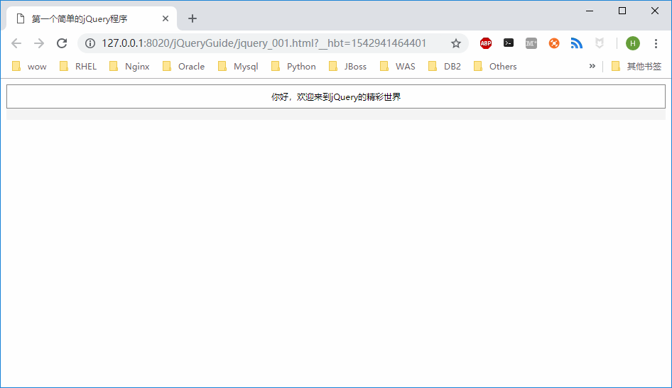

## 搭建jQuery开发环境

由于jQuery是一个完整的JavaScript文件库，因此，搭建jQuery开发环境十分简单，无须安装任何文件，只需要先在jQuery官方网站下载最新的文件库，然后将该文件库引入页面中的`<head>`元素间即可。

### 下载jQuery文件库

jQuery的官方网站为:http://jquery.com。

### 引入jQuery文件库

在页面的`<head></head>`中加入如下代码：
```html
<script language="javascript" type="text/javascript" src="js/jquery-3.3.1.min.js"></script>
```

### 编写一个简单的jQuery程序

```html
<!DOCTYPE html>
<html>
	<head>
		<meta charset="utf-8">
		<title>第一个简单的jQuery程序</title>
		<style type="text/css">
			div {
				padding: 8px 0;
				font-size: 12px;
				text-align: center;
				border: 1px solid #888;
			}
		</style>
		<script src="js/jquery-3.3.1.min.js"></script>
		<script type="text/javascript">
			$(document).ready(function(){
				$("div").html("你好，欢迎来到jQuery的精彩世界");
			});
		</script>
		
	</head>
	<body>
		<div></div>
	</body>
</html>
```
页面效果如下图


**代码分析**

在上述文件的代码中，有一段如下代码:
```jquery
$(document).ready(function(){
		//程序段
});
```
该段代码类似于传统的JavaScript代码：
```javascript
window.onload=function(){
		//程序段
}
```
虽然上述两段代码在功能上可以互换，但它们之间又有许多区别：
+ 执行时间不同：前者在页面框架下载完毕后就执行；面后者必须在页面全部加载完毕（包含图片下载）后才能执行。前者执行效率高于后者。
+ 执行数量不同：前者可以重复写多个，并且每次执行结果不同；而后者尽管可以执行多个，但仅输出最后一个执行结果，无法完成多个结果的输出。

另外，需要注意的是： `$(document).ready(function(){});`可以简写成`$(function(){});`。


