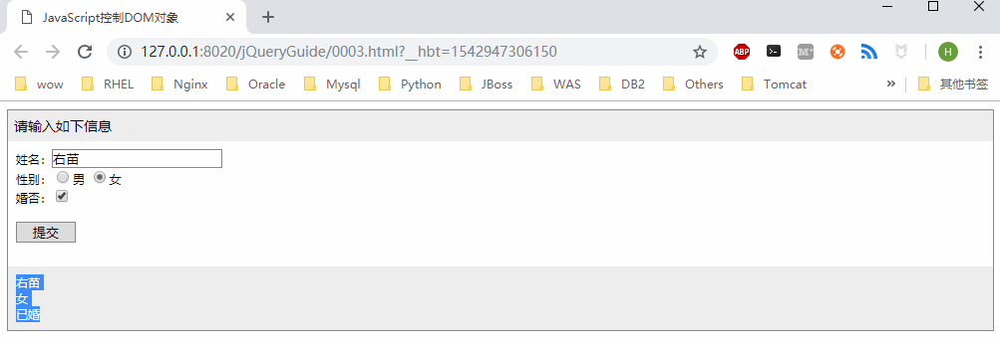

## jQuery简单应用

在介绍使用jQuery开发简单应用之前，首先需要了解如何使用jQuery访问DOM元素，如何将DOM对象转化成jQuery对象，然后通过控制转成的jQuery对象，实现各类应用的功能。

### jQuery访问DOM对象

1. 什么是DOM对象
每一个页面都是一个DOM(Document Object Model，文本对象模型)对象，通过传统的JavaScript方法访问页面中的元素，就是访问DOM对象。
如，页面中有两个`div`元素标记如下
```html
<div id="Tmp">测试魔王</div>
<div id="Out"></div>
```
通过下面的JavaScript代码可以访问DOM对象，以及获取或设置其内容值 ：
```javascript
var tDiv = document.getElementById("Tmp");    //获取DOM对象
var oDiv = document.getElementById("Out");    //获取DOM对象
var cDiv = tDiv.innerHTML;                    //获取DOM对象中的内容
var oDiv.innerHTML = cDiv;                    //设置DOM对象中的内容
```

2. 什么是jQuery对象
在jQuery库中，通过本身自带的方法获取页面元素的对象，称为jQuery对象，为了同样实现在ID为"Out"的标记中显示ID为"Tmp"的标记内容，采用jQuery访问页面元素的方法如下：
```jquery
var tDiv = $("#Tmp");
var oDiv = $("#Out");
oDiv.html(tDiv.html());
```

### jQuery控制DOM对象

在介绍使用jQuery控制DOM对象前，先通过一个简单的示例，说明如何用传统的JavaScript方法访问DOM对象

```html
<!DOCTYPE html>
<html>
	<head>
		<meta charset="UTF-8">
		<title>JavaScript控制DOM对象</title>
		<style type="text/css">
			.iframe {
				border: 1px solid #888888;
				font-size: 14px;
			}
			.title{
				padding: 6px;
				background-color: #EEEEEE;
			}
			.content{
				padding: 8px;
				font-size: 12px;
			}
			.tip {
				background-color: #EEEEEE;
				display: none;
				font-size: 12px;
				padding: 8px;
			}
			.txt {
				border: 1px solid #888888;
			}
			.btn {
				border: 1px solid #888888;
				width: 60px;
			}
			.w260 {
				width: 260px;
			}
		</style>
		
		<script type="text/javascript">
			function btn_Click () {
				var oTxtValue = document.getElementById("Text1").value;
				var oRdoValue = (Radio1.checked)?"男":"女";
				var oChkValue = (Checkbox1.checked)?"已婚":"未婚";
				
				document.getElementById("Tip").style.display = "block";
				document.getElementById("Tip").innerHTML=oTxtValue+"<br/>"+oRdoValue+"<br/>"+oChkValue;
			};
		</script>
	</head>
	<body>
		<div class="iframe">
			<div class="title">请输入如下信息</div>
			<div class="content">
				姓名：<input type="text" id="Text1" class="txt"/><br />
				性别：<input type="radio" id="Radio1" name="rdoSex" value="男" />男
					<input type="radio" name="rdoSex" id="Radio2" value="女" />女 <br />
					
				婚否：<input type="checkbox" id="Checkbox1" /> <br /><br />
					<input type="button" id="btnSubmit" value="提交" class="btn" onclick="btn_Click()"/><br /><br />
			</div>
			<div class="tip" id="Tip"></div>
		</div>
	</body>
</html>
```
以上代码使用传统的JavaScript方法获取用户输入的信息，并保存到变量中，最后通过`document.getElementById("Tip").innerHTML`方法显示所有的数据信息。

在引入jQuery库，通过jQuery中的方法获取元素的值，并将获取的数据显示出来。其修改后的JavaScript代码如下：
```html
<!DOCTYPE html>
<html>
	<head>
		<meta charset="UTF-8">
		<title>JavaScript控制DOM对象</title>
		<style type="text/css">
			.iframe {
				border: 1px solid #888888;
				font-size: 14px;
			}
			.title{
				padding: 6px;
				background-color: #EEEEEE;
			}
			.content{
				padding: 8px;
				font-size: 12px;
			}
			.tip {
				background-color: #EEEEEE;
				display: none;
				font-size: 12px;
				padding: 8px;
			}
			.txt {
				border: 1px solid #888888;
			}
			.btn {
				border: 1px solid #888888;
				width: 60px;
			}
			.w260 {
				width: 260px;
			}
		</style>
		<script src="js/jquery-3.3.1.min.js"></script>
		<script type="text/javascript">
			$(function() {
				$("#btnSubmit").click(function() {
					var oTxtValue = $("#Text1").val();
					var oRdoValue = $("#Radio1").is(":checked")?"男":"女";
					var oChkValue = $("#Checkbox1").is(":checked")?"已婚":"未婚";
					
					$("#Tip").css("display","block").html(oTxtValue+"<br/>"+oRdoValue+"<br/>"+oChkValue);
				})
			});
		</script>
	</head>
	<body>
		<div class="iframe">
			<div class="title">请输入如下信息</div>
			<div class="content">
				姓名：<input type="text" id="Text1" class="txt"/><br />
				性别：<input type="radio" id="Radio1" name="rdoSex" value="男" />男
					<input type="radio" name="rdoSex" id="Radio2" value="女" />女 <br />
					
				婚否：<input type="checkbox" id="Checkbox1" /> <br /><br />
					<input type="button" id="btnSubmit" value="提交" class="btn"/>
					<br />
					<br />
			</div>
			<div class="tip" id="Tip"></div>
		</div>
	</body>
</html>
```
效果如下：

