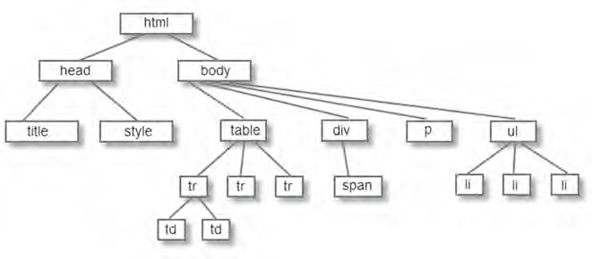

## DOM树状模型

与DOM密不可分的是JavaScript脚本技术，DOM在客户端的应用也是基于该技术，通过该技术我们可以很方便访问、检索、操作文档中的任何一个元素。因此，学好JavaScript脚本技术，是掌握DOM对象的一个重要条件。

Document即文档，当我们创建一个页面并加载到Web浏览器时，DOM模型根据该页面的内容创建一个文档文件。

Object即对象，是批具有独立特性的一组数据集合，如，我们把新建的页面文档称为文档对象，与对象相关联的特征称这为对象属性，访问对象的函数称为为对象方法。

Model即模型，在页面文档中，通过树状模型展示页面的元素和内容，其展示的方式 则是通过节点(Node)来实现的。

一个普通的页面文档创建的DOM树状结构如下：

在访问页面时，需要与页面中的元素进行交互互的操作。在操作中，元素的访问是最频繁、最常用的，主要包括元素属性、内容、值、CSS的操作。下面将分小节一一介绍